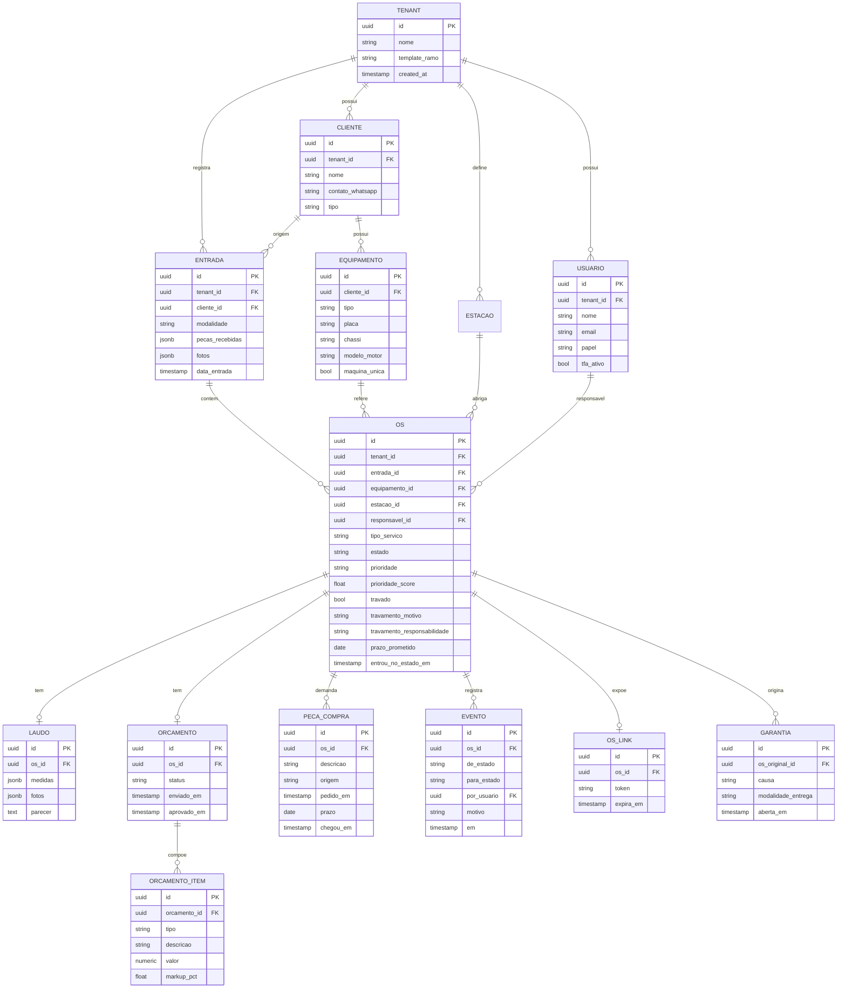
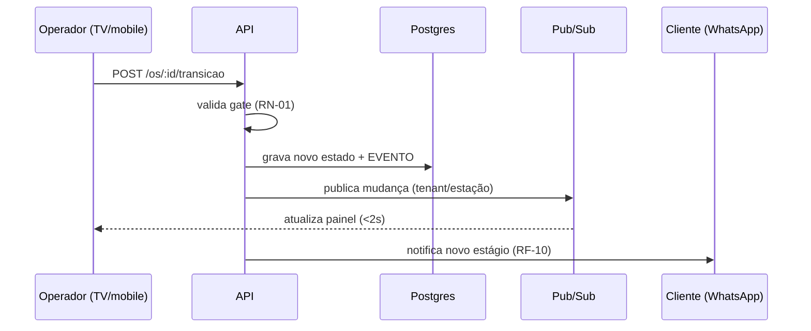

# Arquitetura — PRONTO (codinome)

> Fase 3, o **como** (micro). Cada escolha conecta ao macro (Fase 1) e aos requisitos
> (Fase 2). Decisões relevantes viram ADR em `/docs/adr`.
>
> **Fase 3 tem duas partes.** Esta é a **Parte A — arquitetura técnica**. A **Parte B**
> (design system, grid/breakpoints e spec por tela com 6 estados, pela skill devdead-front)
> vem em seguida para fechar a fase.

---

## Stack tecnológica (com justificativa)

| Camada | Escolha | Justificativa (ligação ao macro) |
|--------|---------|----------------------------------|
| **Frontend** | Next.js (React) + TypeScript + Tailwind | O Canvas posiciona o produto como **visual-first** com modo TV + mobile; React/Tailwind dá velocidade de UI e o protótipo já é React; Next entrega roteamento e bom isolamento por rota para multi-tenant. |
| **Tempo real** | Pub/sub gerenciado (Postgres LISTEN/NOTIFY + gateway WS, ou serviço tipo Ably/Pusher/Supabase Realtime) | RNF-PERF-01 exige propagação < ~2s para as TVs; pub/sub **empurra** a mudança de estado em vez de polling. |
| **Backend** | TypeScript — no MVP, Next.js full-stack (server actions/API routes) + serviço dedicado só para o canal realtime | Um só idioma acelera o fundador; começar monolítico reduz complexidade; o caminho de extração de serviços está num ADR. |
| **Banco** | PostgreSQL + Row-Level Security (RLS) | Dados relacionais (OS, estados, eventos, tenants), integridade referencial e ACID (financeiro da onda 2); a RLS aplica o **isolamento multi-tenant** (RNF-SEC-03) no nível do banco. |
| **ORM/Migrations** | Prisma (ou Drizzle como alternativa SQL-first) | Migrations versionadas em VCS; acelera o CRUD. Escolha final formalizável em ADR. |
| **Auth** | Provedor gerenciado com RBAC + 2FA para admin (Auth.js/Supabase Auth/Clerk) | RNF-SEC-01/02/04; terceirizar auth reduz risco e tempo. |
| **Notificações** | Provedor de WhatsApp (Meta Cloud API ou agregador BR) | RF-10 (status automático ao cliente); **integrar, não construir**. |
| **Infra** | Cloud gerenciada (front no Vercel + Postgres gerenciado tipo Neon/Supabase) | Foco em produto, não em ops; escala gerenciada (RNF-ESC-01). |

> Escolhas de fornecedor são substituíveis; o que é firme é o **padrão** (Postgres+RLS,
> pub/sub para o painel, auth gerenciada, WhatsApp por integração).

---

## Schema de banco (ERD) — MVP (onda 1)

> **Financeiro** (custo real, margem, fluxo de caixa) é **onda 2** — entra como entidades
> ligadas à OS depois, sem reescrever o núcleo.

---

## Design de API (REST + canal realtime)

**Autenticação**: `POST /auth/login` · `POST /auth/2fa` · `POST /auth/refresh`

**OS / máquina de estados**:
- `POST /os` — abre OS (modalidade, peças, fotos, veículo, cliente)
- `GET /os` · `GET /os/:id`
- `POST /os/:id/transicao` — avança estado **validando o gate**; grava EVENTO; dispara push + notificação
- `POST /os/:id/bump` — atalho de avanço por estação (uso de chão, com luva)
- `PATCH /os/:id/prioridade` — override humano (registrado)
- `POST /os/:id/travar` · `POST /os/:id/destravar` — com motivo e responsabilidade

**Triagem**: `GET /triagem` — fila ordenada por `prioridade_score`

**Orçamento**: `POST /os/:id/orcamento` · `PATCH /orcamento/:id/item` · `POST /orcamento/:id/enviar`

**Portal do cliente (público, por token)**:
- `GET /p/:token` — estágio + responsabilização
- `POST /p/:token/aprovar` · `POST /p/:token/recusar`

**Painel**: `GET /painel/setor/:estacaoId` · `GET /painel/kpis`

**Cadastros**: CRUD `/clientes` · `/equipamentos` · `/estacoes` · `/usuarios`

**Config**: `GET|PUT /config/template`

**Realtime**: `WS /realtime?tenant=…&estacao=…` — assina mudanças de estado do setor

### Fluxo crítico — avançar etapa (sequência)

---

## EAP / WBS (decomposição em módulos)

- **M1 — Tenancy & Auth**: RLS por tenant, RBAC (papéis), 2FA admin, gestão de usuários/oficina.
- **M2 — OS & Máquina de Estados**: entrada (A/B/C), estados, **gates**, EVENTO/linha do tempo.
- **M3 — Triagem & Travamento**: cálculo da razão crítica, gatilhos do ramo, override, **regra da vez**.
- **M4 — Painel & Realtime**: modo TV por setor, cor por tempo, **bump**, KPIs, canal pub/sub.
- **M5 — Orçamento & Aprovação**: montagem (peças/mão de obra), envio por link, gate de aprovação.
- **M6 — Portal do Cliente**: status + responsabilização + aprovar/recusar.
- **M7 — Notificações**: WhatsApp por evento de transição.
- **M8 — Templates de Ramo**: config de estações/gates/gatilhos por tenant (retífica pesada/agro, leve, centro automotivo).

Pacotes de entrega do MVP: M1 → M2 → M3 → M4 → M5/M6 → M7, com M8 transversal.

---

## Estratégia de migração (camada de dados)
- Todo o schema evolui por **migrations versionadas** em VCS (Prisma Migrate/Drizzle).
  Nenhuma alteração manual direta no banco.
- **Políticas RLS são migrations** — versionadas junto, nunca aplicadas à mão.
- Requisitos especiais de managed DB (extensões, `search_path`) documentados em ADR.

## Estratégia de testes
- **Unidade**: transições da máquina de estados, cálculo da razão crítica, lógica dos gates,
  regra de travamento/vez.
- **Integração**: rotas + DB, incluindo **teste de isolamento multi-tenant** (tenant A não lê
  dados de B) — *obrigatório* na Definition of Done.
- **E2E**: ciclo da OS (entrada → entrega) e fluxo de aprovação do cliente pelo link.
- Os testes do caminho principal são a fonte de verdade da auditoria (devdead-audit).

---

## Checklist — fixo vs configurável

| Item | Decisão |
|------|---------|
| Threshold de tentativas de login | **Configurável** (RNF-SEC-05) |
| Estações, gates e gatilhos de triagem | **Configurável** por template/tenant (M8) |
| Pesos da razão crítica / SLAs por prioridade | **Configurável** (regra de negócio) |
| Datas / fusos | Salvar em **UTC/ISO 8601**; converter por localidade |
| Feriados | **Tabela/API**, nunca chumbado |
| Token do link do cliente / expiração | **Configurável** |
| Paginação técnica (ex.: 20/página) | Fixo OK |
| Preços / planos | **Configurável** (DB/painel), nunca em código |

Regra: o que muda por decisão de negócio/marketing **não** pode exigir novo deploy.

---

## Resumo da Parte A
Stack justificada, ERD do MVP (14 entidades) em Mermaid, design de API com o fluxo crítico,
EAP em 8 módulos, estratégias de migração e testes, e o checklist de fixo vs configurável.
ADRs registrados: 001 (Postgres+RLS), 002 (painel realtime), 003 (MVP full-stack Next).

**Próximo**: Parte B — design system + grid/breakpoints + spec por tela (6 estados) pela skill
devdead-front, para então fechar a Fase 3 inteira.
